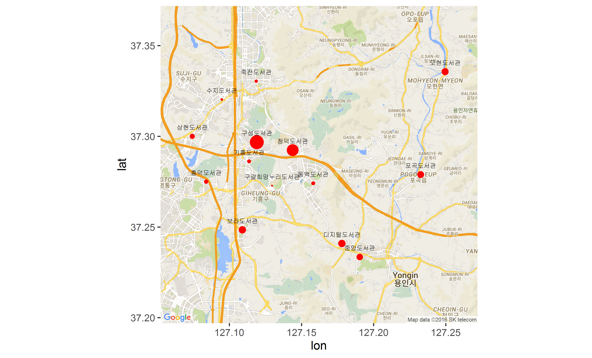

# yongin_library_map
R을 이용해 용인시 도서관을 지도에 표시해 보자  
[공공데이터포털](https://www.data.go.kr) 의 [경기도_용인시_도서관_정보](https://www.data.go.kr/subMain.jsp?param=REFUQUAxNTAxNjM2Mw==#/L2NvbW0vY29tbW9uU2VhcmNoL29yZ2luRGF0YVNldCRAXjAxMm0xJEBecHVibGljRGF0YVBrPTE1MDE2MzYzJEBeYnJtQ2Q9T0MwMDAxJEBeZXhjZWxDb3VudD0wJEBeZG93bmxvYWRDb3VudD0zJEBeb3JnSW5kZXg9REFUQSRAXm1heFJvd3M9MTAwMCRAXnNraXBSb3dzPTA=) 를 
활용하였습니다.  

